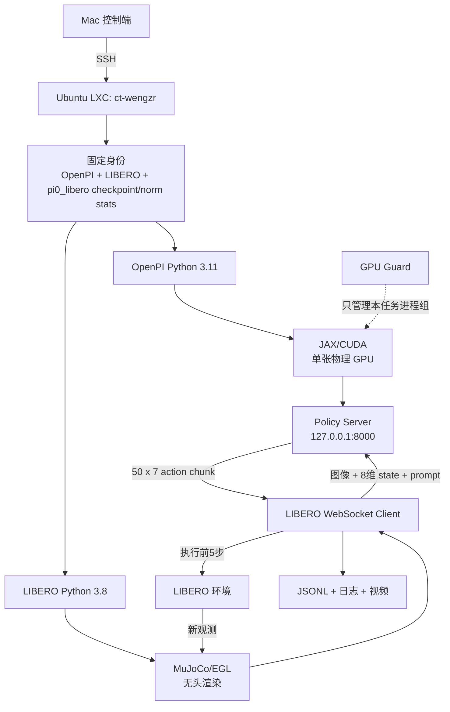
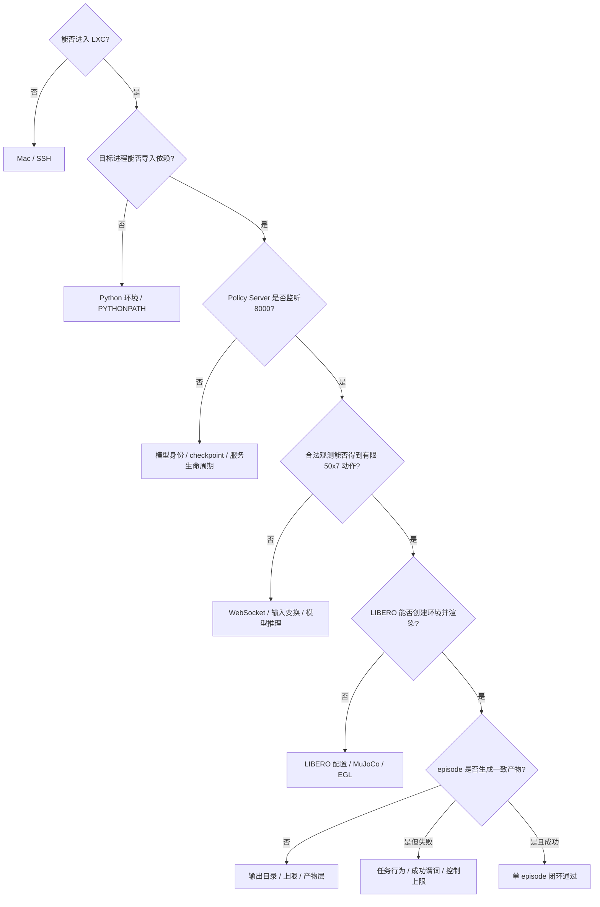

# π0-LIBERO 部署全景与故障定位

这份笔记不要求记住一串检查命令。目标是面对一个症状时，先判断故障属于哪一层，
再选择能够推翻或支持该层假设的最小证据。

## 1. 一次成功 episode 的系统因果链



上游只为下游提供必要条件，不自动证明下游正确。例如，SSH 成功只证明能够进入
LXC；它不证明 Python 环境、GPU、模型或仿真能够运行。

## 2. 每一层提供什么证据

| 层 | 向下游提供 | 典型故障 | 最有区分度的证据 | 该证据仍不能证明 |
| --- | --- | --- | --- | --- |
| Mac / SSH | 远程控制通道 | 连接超时、密钥或代理错误 | 登录后得到 `wengzr@ct-wengzr` | 项目依赖可用 |
| Git 与模型身份 | 固定代码、任务和模型语义 | 结果无法复现、误用 π0.5 | 两个 commit、`pi0_libero`、checkpoint 和 norm stats 身份一致 | GPU 能加载模型 |
| 双 Python 环境 | 两套互不污染的依赖 | import error、版本冲突 | OpenPI 为3.11，LIBERO 为3.8，解释器路径分离 | CUDA 或 EGL 正常 |
| JAX / CUDA | 模型计算 | 只看到 CPU、OOM、错误物理卡 | 进程内只有一个 `CudaDevice(0)`，并映射到预选物理卡 | MuJoCo 能渲染 |
| MuJoCo / EGL | 无显示器的相机图像 | EGL 初始化失败、黑帧 | 指定卡上能产生尺寸和像素范围合理的测试帧 | 模型能推理 |
| Policy Server | 常驻推理服务入口 | 端口拒绝、启动后退出 | `127.0.0.1:8000` 监听且 PID 属于本任务 | checkpoint 正确或输出有限 |
| WebSocket 推理 | 观测与动作协议 | 序列化、键名或 shape 错误 | 合法观测返回有限的 `50×7` 动作 | 动作能完成任务 |
| LIBERO 闭环 | 执行动作并产生新观测 | 行为失败、成功谓词未触发 | episode 成功、控制步与请求数合理 | 完整 benchmark 成功率 |
| 产物层 | 可审计结果 | 日志缺失、视频与 JSON 不一致 | JSONL、摘要、日志和视频相互对应 | 所有失败原因已经解释 |

## 3. 为什么必须是两个 Python 环境

OpenPI 的 JAX、模型和服务端运行在 Python 3.11；固定 LIBERO、robosuite 和仿真
依赖运行在 Python 3.8。强行装进同一个环境，包管理器可能成功安装一部分依赖，
却在导入、运行或 ABI 层产生冲突。

项目没有要求两套依赖彼此兼容，而是把兼容边界放在 WebSocket 协议上：

```text
Python 3.8 仿真进程 -- MessagePack/WebSocket --> Python 3.11 模型进程
```

因此排错时，先问“错误来自哪一个进程”，再进入对应环境。不要因为两个进程都
属于同一项目，就在两个环境里重复安装同一个包。

## 4. 为什么 checkpoint 必须绑定 norm stats

checkpoint 保存模型参数；norm stats 定义训练时输入状态和动作的数值尺度。策略
在推理前按这组统计量归一化观测，在推理后反归一化动作。

错误的 norm stats 往往不会产生明显的 shape error：服务可能正常监听，模型也能
返回 `50×7` 的有限数字，但动作尺度或各维含义会偏离训练分布，最终表现为异常
运动或任务失败。因此“输出 shape 正确”不能替代 checkpoint 与 norm stats 身份
绑定检查。

## 5. 为什么 JAX 正常不等于 EGL 正常

JAX/CUDA 和 MuJoCo/EGL 虽然使用同一张物理 GPU，却经过两条不同的软件路径：

```text
模型：JAX -> XLA -> CUDA
渲染：MuJoCo -> OpenGL -> EGL -> NVIDIA vendor/device
```

JAX 能看到 `cuda:0` 只证明计算路径；EGL 仍可能因为 vendor 文件、device index
或无头图形配置失败。反过来，EGL 能渲染一帧也不证明 checkpoint 能被 JAX 恢复。
两条路径必须分别验证，并确认它们映射到同一张预选物理卡。

## 6. 如何理解逐级证据

本项目已经记录过这样一条成功证据链：

1. 固定 commits、checkpoint、norm stats 与双环境身份一致；
2. JAX、PyTorch 和 EGL 的单卡映射通过；
3. Policy Server 恢复原始 `pi0_libero` checkpoint；
4. 单次合法观测返回有限的 `50×7` 动作；
5. `libero_spatial` task 0、state 0 在77个控制步和16次策略请求后成功；
6. 结构化结果和成功视频均生成，随后端口、进程和显存释放。

证据强度依次增加：

```text
端口监听
  < 合法 50×7 推理
  < episode 成功并有一致视频/结果
  < 固定协议下完整 2,000-episode 统计
```

单个成功视频证明闭环部署可运行，但不能代表四个 suite 的成功率；完整 benchmark
统计能描述固定协议下的表现，但也不能自动解释每个失败的行为原因。

## 7. 症状优先的故障定位

| 症状 | 首先怀疑的层 | 第一条有用问题 |
| --- | --- | --- |
| Mac 无法建立 SSH | Mac / SSH | 网络、SSH alias、密钥或代理哪一步尚未建立？ |
| 同一命令出现 `ModuleNotFoundError` | Python 环境 | 当前错误属于模型进程还是仿真进程，使用了哪个解释器？ |
| `jax.devices()` 只有 CPU | JAX / CUDA | GPU 是否被正确暴露，JAX CUDA backend 是否可用？ |
| JAX 正常但 MuJoCo 无法创建相机 | EGL | vendor 文件和 EGL device 是否映射到同一物理卡？ |
| 连接 `127.0.0.1:8000` 被拒绝 | Policy Server | 服务是否启动、是否仍存活、是否监听预期端口？ |
| 端口已监听但第一次 `infer` 报错 | 模型或 WebSocket | 是 checkpoint 恢复、输入键、序列化还是 shape 错误？ |
| 返回 `50×7`，但机器人动作异常 | 变换与模型身份 | checkpoint、norm stats、policy config 是否配套？ |
| 仿真运行但 episode 失败 | LIBERO 行为层 | 是抓取/放置行为失败，还是系统异常或步数上限？ |
| episode 成功但找不到视频 | 产物层 | 输出目录、写入上限和视频记录是否启用？ |

定位原则是从症状所在层向上检查最近的必要条件，而不是从安装环境开始全部重做。
例如“端口连接被拒绝”时，先查 Policy Server 生命周期；没有证据表明 Python 环境
损坏，就不应重新安装依赖。

## 8. 运行时保护属于哪一层

GPU Guard 不参与模型算法，也不判断任务成功。它位于运行时资源层，只控制自己
创建且核实的进程组：资源达到暂停阈值时暂停本任务，恢复条件稳定后继续；达到
紧急阈值时停止本任务。它不能证明模型正确，也绝不能操作其他用户进程。

完整操作顺序和阈值仍以 [部署 Runbook](deployment_runbook.md) 为准；算法输入、
动作块和闭环原理见 [算法概览](algorithm_overview.md)。

## 9. 最小证据排错决策树

排错不是从安装步骤重新开始，而是寻找两个相邻边界：

```text
最后一个已通过边界 -> 第一个失败边界
```

例如端口8000已经监听，但第一次推理报输入 shape 错误，那么 SSH、Git、进程启动
和 TCP 监听都不是当前首要问题；检查范围应收缩到 WebSocket 请求、输入适配和模型
调用之间。



### 排错记录的五个字段

每次只记录：

1. **症状**：用户或日志直接观察到的事实；
2. **最后通过边界**：已有哪条证据证明上游正常；
3. **第一个失败边界**：哪一层首次不满足预期；
4. **最小区分证据**：只运行什么检查就能区分两个最可能原因；
5. **下一步决定**：修复、停止、进入下一层，还是保留现场继续取证。

### 四类常见误判

| 症状 | 容易采取的错误动作 | 更合理的第一步 |
| --- | --- | --- |
| `ModuleNotFoundError` | 在两个环境里同时重装依赖 | 先确认报错进程及其 `sys.executable` |
| 连接8000被拒绝 | 修改防火墙或重装 WebSocket | 先确认 Policy Server 是否成功活到监听阶段 |
| JAX 正常、相机失败 | 重装 JAX/CUDA | 检查 EGL vendor 与 device 映射 |
| episode 运行但失败 | 重建整个环境 | 先区分系统异常、控制上限和可见行为失败 |

不要用重新安装来代替定位，也不要为了“清理环境”宽泛终止进程。共享服务器上只能
处理本任务已经记录并核实的进程、目录和日志。

## 10. Policy Server 生命周期

Policy Server 不是“有一个 PID 就已经正常”，而是依次跨过七个边界：

```text
创建进程
  -> Python 依赖导入
  -> config / checkpoint / norm stats 恢复
  -> 绑定并监听端口8000
  -> 接收并解码 WebSocket 请求
  -> 完成输入变换与模型推理
  -> 返回有限的 50x7 动作
```

| 阶段 | 真实可能失败什么 | 决定性证据 | 证据改变的下一步 |
| --- | --- | --- | --- |
| 创建进程 | 命令、路径或权限错误 | 包装器记录了本任务子进程 PID，且进程没有立即退出 | 才进入启动日志判断 |
| 导入依赖 | 解释器选错、模块或动态库缺失 | 日志越过 import，或明确出现首个 import traceback | 切换正确环境，而不是先查端口 |
| 恢复策略 | 误用 π0.5、checkpoint/norm stats 缺失或不匹配 | 启动参数身份正确，策略构造越过恢复阶段 | 才等待服务入口 |
| 监听8000 | 端口冲突、进程在 bind 前退出 | 本任务 PID 的日志出现 listening，端口归属与该 PID 一致 | 才允许客户端连接 |
| 接收请求 | 地址、WebSocket 或 MessagePack 协议失败 | 客户端完成连接，服务端收到并解码请求 | 才归因到模型调用 |
| 完成推理 | 输入键、shape、变换、JAX 或模型执行失败 | `infer` 返回结果而非 traceback | 才检查输出契约 |
| 返回动作 | 输出缺键、shape 错误或 NaN/Inf | `actions.shape == (50, 7)` 且全部有限 | 才进入 LIBERO episode |

### PID、端口和推理结果分别证明什么

- **PID 存在**：只证明操作系统中仍有这个进程；它可能仍在加载 checkpoint、已经
  卡住，或尚未绑定端口。
- **端口8000监听**：如果同时核实为本任务 PID，可证明服务入口已建立。在本项目
  的 `serve_policy.py` 启动顺序中，策略构造发生在开始监听之前，因此这是恢复阶段
  已越过的较强证据；但单独一条 `ss` 输出不能证明监听者身份、启动参数或推理正确。
- **WebSocket 连接成功**：证明客户端到服务端的传输入口可达，不证明请求内容符合
  模型输入契约。
- **有限的 `50x7` 动作**：证明单次请求跨过传输、输入变换、模型推理和输出变换；
  仍不证明动作能够完成 LIBERO 任务。

项目的推理探针正是按这个边界设计：先记录服务 PID，等待本任务日志出现 listening，
再发送一份合法观测，最后检查动作 shape 和有限性。正常或异常退出时，只清理包装器
记录并核实的服务 PID，不能按进程名宽泛终止其他任务。

## 11. WebSocket、JAX/CUDA 与 MuJoCo/EGL 三条边界

这三条路径会在一次 episode 中相遇，但它们不是同一套系统：

```text
真实观测路径：LIBERO -> MuJoCo/EGL -> 图像
传输协议路径：图像/state/prompt -> WebSocket -> actions
模型计算路径：输入变换 -> JAX/XLA/CUDA -> 动作生成
```

| 边界 | 它验证的假设 | 不检查可能出现的故障 | 决定性字段 | 结果改变的决定 |
| --- | --- | --- | --- | --- |
| JAX/CUDA | 模型进程只看到预选单卡且能运行计算后端 | 只看到 CPU、映射错卡、XLA/OOM | `backend=gpu`、设备数1、逻辑 `CudaDevice(0)` 与物理卡对应 | 是否允许加载 checkpoint 或推理 |
| MuJoCo/EGL | 仿真进程能在无显示器环境创建 GPU 图形上下文并产生有效相机图像 | EGL vendor/device 错误、上下文失败、黑帧 | context 创建成功；真实帧的 shape、dtype、像素范围和视频内容合理 | 是否允许把图像作为模型观测 |
| WebSocket | 两个 Python 进程遵守同一序列化和输入输出协议 | 连接拒绝、MessagePack、缺键、shape 或响应错误 | 请求被解码；响应含有限的 `50x7` actions | 是否允许客户端执行动作 |

### 同一张 GPU 不等于同一条软件路径

`CUDA_VISIBLE_DEVICES=<physical_gpu>` 让 JAX/PyTorch 只看到一张卡，并把它在进程
内重编号为逻辑设备0。EGL 使用 OpenGL/EGL 的设备枚举和 vendor 配置；CUDA 变量
不会自动证明 EGL 选择正确。因此两边即使计划使用同一张物理卡，也要分别验证。

WebSocket 本身是进程间协议，不等于 GPU 计算。客户端能发送请求，只说明传输入口
可达；服务端仍可能在 JAX 推理时 OOM。相反，JAX 本地计算正常时，客户端仍可能因
MessagePack、观测键或 shape 不符合协议而失败。

### 最小探针仍有边界

- `jax_mapping.json` 证明 JAX backend 和可见设备，不证明 checkpoint 可恢复；
- `egl_mapping.json` 中的 context `ok` 证明能创建 EGL 上下文，不证明真实 LIBERO
  相机帧不是黑帧或错误相机；
- `inference_result.json` 使用合成合法观测，证明一次模型协议能返回有限 `50x7`
  动作，不证明真实仿真观测内容正确；
- 只有真实 episode 的视频、结构化结果和日志一致，才把三条路径连接成闭环证据。

因此“哪个探针通过”必须和“它使用的输入是什么”一起解释。不能用合成观测推理
成功来证明真实相机图像正确，也不能用 EGL context 创建成功来证明模型数值有效。
